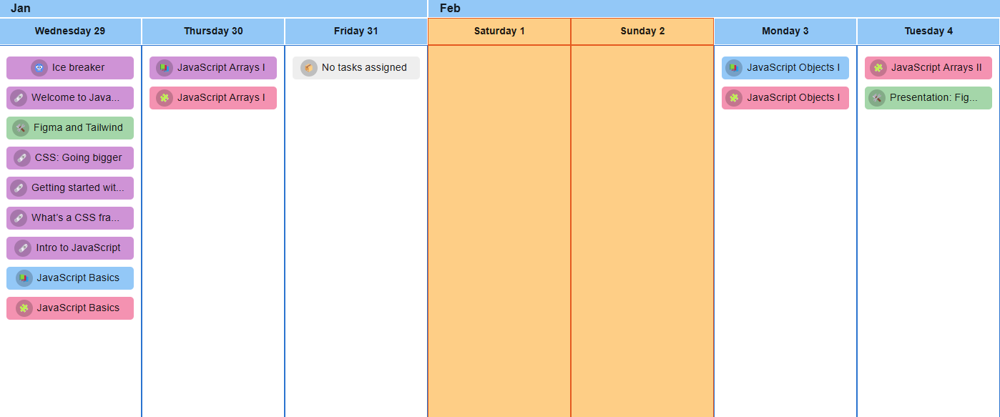
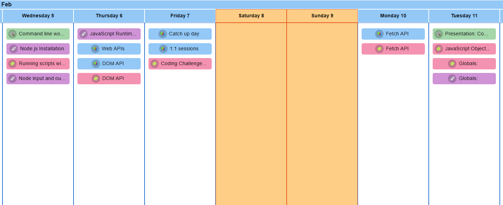
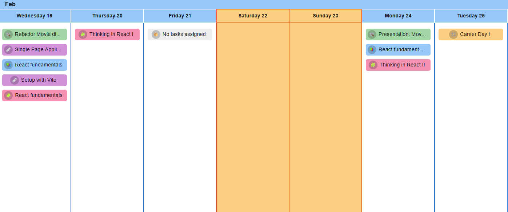
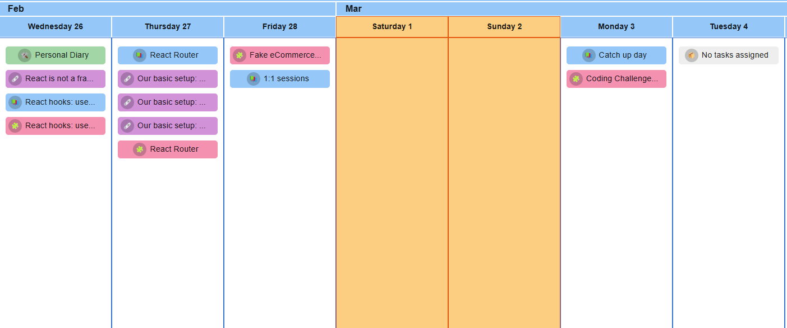
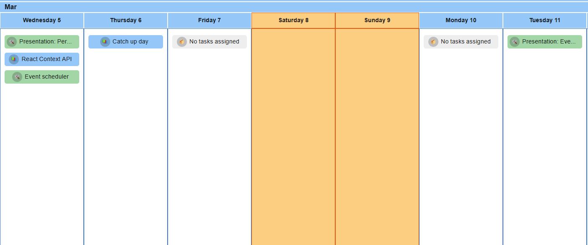

# FE

This repository is going to hold all of the information for the front-end part of the bootcamp. I will upload here any code written during the lectures and the corrections of the activities.

## Week-01
    ```text
    Start Date: 29/01/2025
    End Date: 04/02/2025
    Module: Intro to JavaScript
    Group project: Figma and Tailwind
    ```



## Week-02
```text
    Start Date: 05/02/2025
    End Date: 11/02/2025
    Module: Web APIs
    Group project: Command line word games
```



## Week-03
```text
    Start Date: 12/02/2025
    End Date: 18/02/2025
    Module: Javascript Modules
    Group project: Movie Diary or Pokedex
```


## Week-04
```text
    Start Date: 19/02/2025
    End Date: 25/02/2025
    Module: Intro to React
    Group project: Refractor Movie Diary or Pokedex
```



## Week-05
```text
    Start Date: 26/02/2025
    End Date: 04/03/2025
    Module: Building applications with React
    Group project: Personal Diary
```



## Week-06
```text
    Start Date: 05/03/2025
    End Date: 11/03/2025
    Module: Gen AI Integration
    Group project: Event Scheduler
```



### You have succesfully finished the Front-End path! Congrats!
